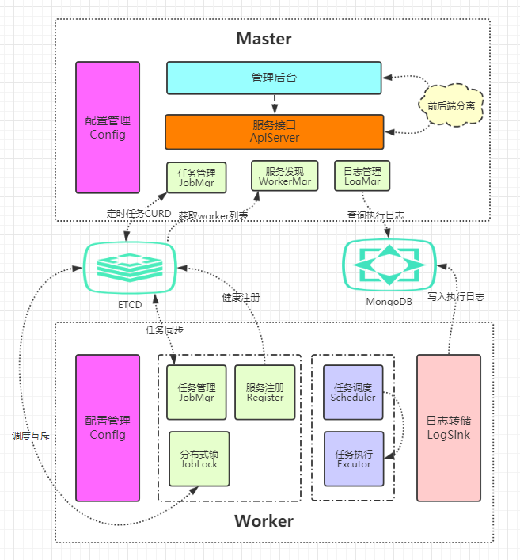

# goCrontab

### 项目架构图

### 项目结构
    github.com/goCrontab/
                        /master
                        /worker
                        /common
                        
### master:
1. 搭建go项目框架，配置文件，命令行参数，线程配置；
2. 给Web后台提供http API, 用于管理Job；
3. 写一个Web后台的前端页面，bootstrap+jquery，前后端分离开发。

### worker:
1. 从etcd中把job同步到内存中；
2. 实现调度模块，基于cron表达式调度N个job；
3. 实现执行模块，并发的执行多个job；
4. 对job的分布式锁，防止集群并发执行同一个job；
5. 把任务执行日志保存到mongodb。